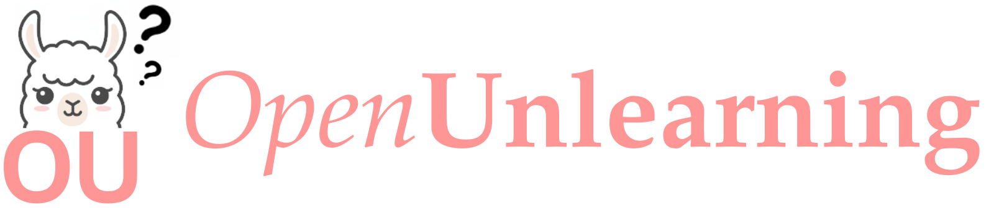

<div align="center">



<h3><strong>An easily extensible framework unifying LLM unlearning evaluation benchmarks.</strong></h3>

  <div style="display: flex; gap: 10px; justify-content: center; align-items: center;">
      <a href="https://github.com/locuslab/open-unlearning/actions">
          
      </a>
      <a href="https://huggingface.co/open-unlearning">
        
      </a>
      <a href="https://github.com/locuslab/open-unlearning">
        
      </a>
  </div>
</div>

---

## 📖 Overview

We provide efficient and streamlined implementations of the TOFU, MUSE unlearning benchmarks while supporting 6 unlearning methods, 3+ datasets, 6+ evaluation metrics, and 7+ LLMs. Each of these can be easily extended to incorporate more variants.

We invite the LLM unlearning community to collaborate by adding new benchmarks, unlearning methods, datasets and evaluation metrics here to expand OpenUnlearning's features, gain feedback from wider usage and drive progress in the field.

> ⚠️ **Notice (Updated: February 27, 2025)**  
> This repository replaces the original TOFU codebase, which can be found at [`github.com/locuslab/tofu`](https://github.com/locuslab/tofu) and isn't maintained anymore.

## 🗃️ Available Components

We provide several variants for each of the components in the unlearning pipeline.

| **Component**          | **Available Options** |
|------------------------|----------------------|
| **Benchmarks**        | [TOFU](https://arxiv.org/abs/2401.06121), [MUSE](https://muse-bench.github.io/) |
| **Unlearning Methods** | GradAscent, GradDiff, NPO, SimNPO, DPO, RMU |
| **Evaluation Metrics** | Verbatim Probability, Verbatim ROUGE, QA-ROUGE, MIA Attacks, TruthRatio, Model Utility |
| **Datasets**          | MUSE-News (BBC), MUSE-Books (Harry Potter), TOFU (different splits) |
| **Model Families**    | TOFU: LLaMA-3.2, LLaMA-3.1, LLaMA-2; MUSE: LLaMA-2, ICLM; Additional: Phi-3.5, Phi-1.5, Gemma |

---

## 📌 Table of Contents
- 📖 [Overview](#-overview)
- 🗃️ [Available Components](#%EF%B8%8F-available-components)
- ⚡ [Quickstart](#-quickstart)
  - 🛠️ [Environment Setup](#-environment-setup)
  - 💾 [Data Setup](#-data-setup)
- 🔄 [Updated TOFU benchmark](#-updated-tofu-benchmark)
- 🧪 [Running Experiments](#-running-experiments)
  - 🚀 [Perform Unlearning](#-perform-unlearning)
  - 📊 [Perform an Evaluation](#-perform-an-evaluation)
  - 📜 [Running Baseline Experiments](#-running-baseline-experiments)
- ➕ [How to Add New Components](#-how-to-add-new-components)
- 📚 [Further Documentation](#-further-documentation)
- 🔗 [Support & Contributors](#-support--contributors)
- 📝 [Citing this work](#-citing-this-work)
- 🤝 [Acknowledgements](#-acknowledgements)
- 📄 [License](#-license)

---

## ⚡ Quickstart

### 🛠️ Environment Setup

```bash
conda create -n unlearning python=3.11
conda activate unlearning
pip install .
pip install --no-build-isolation flash-attn==2.6.3
```

### 💾 Data Setup
Download the log files containing metric results from the models used in the supported benchmarks (including the retain model logs used to compare the unlearned models against).

```bash
python setup_data.py # populates saves/eval with evaluation results of the uploaded models
```

---

### 🔄 Updated TOFU benchmark

We've updated Open-Unlearning's TOFU benchmark target models to use a wider variety of newer architectures with sizes varying from 1B to 8B. These include LLaMA 3.2 1B, LLaMA 3.2 3B, LLaMA 3.1 8B, and the original LLaMA-2 7B from [the old version of TOFU](github.com/locuslab/tofu). 

For each architecture, we have finetuned with four different splits of the TOFU datasets: `full`, `retain90`, `retain95`, `retain99`, for a total of 16 finetuned models. The first serves as the target (base model for unlearning) and the rest are retain models used to measure performance against for each forget split. These models are on [HuggingFace](`https://huggingface.co/collections/open-unlearning/tofu-new-models-67bcf636334ea81727573a9f0`) and the paths to these models can be set in the experimental configs or in command-line overrides.

---

## 🧪 Running Experiments

We provide an easily configurable interface for running evaluations by leveraging Hydra configs. For a more detailed documentation of aspects like running experiments, commonly overriden arguments, interfacing with configurations, distributed training and simple finetuning of models, refer [`docs/experiments.md`](docs/experiments.md).

### 🚀 Perform Unlearning

An example command for launching an unlearning process with `GradAscent` on the TOFU `forget10` split:

```bash
python src/train.py --config-name=unlearn.yaml experiment=unlearn/tofu/default \
  forget_split=forget10 retain_split=retain90 trainer=GradAscent task_name=SAMPLE_UNLEARN
```

- `experiment`- Path to the Hydra config file [`configs/experiment/unlearn/muse/default.yaml`](configs/experiment/unlearn/tofu/default.yaml) with default experimental settings for TOFU unlearning, e.g. train dataset, eval benchmark details, model paths etc..
- `forget_split/retain_split`- Sets the forget and retain dataset splits.
- `trainer`- Load [`configs/trainer/GradAscent.yaml`](configs/trainer/GradAscent.yaml) and override the unlearning method with the handler (see config) implemented in [`src/trainer/unlearn/grad_ascent.py`](src/trainer/unlearn/grad_ascent.py).

### 📊 Perform an Evaluation

An example command for launching a TOFU evaluation process on `forget10` split:

```bash
python src/eval.py --config-name=eval.yaml experiment=eval/tofu/default \
  model=Llama-3.2-1B-Instruct \
  model.model_args.pretrained_model_name_or_path=open-unlearning/tofu_Llama-3.2-1B-Instruct_full \
  task_name=SAMPLE_EVAL
```

- `experiment`- Path to the evaluation configuration [`configs/experiment/eval/tofu/default.yaml`](configs/experiment/eval/tofu/default.yaml).
- `model`- Sets up the model and tokenizer configs for the `Llama-3.2-1B-Instruct` model.
- `model.model_args.pretrained_model_name_or_path`- Overrides the default experiment config to evaluate a model from a HuggingFace ID (can use a local model checkpoint path as well).

For more details about creating and running evaluations, refer [`docs/evaluation.md`](docs/evaluation.md).


### 📜 Running Baseline Experiments
The scripts below execute standard baseline unlearning experiments on the TOFU and MUSE datasets, evaluated using their corresponding benchmarks. The expected results for these are in [`docs/results.md`](docs/results.md).

```bash
bash scripts/tofu_unlearn.sh
bash scripts/muse_unlearn.sh
```

---

## ➕ How to Add New Components

Adding a new component (trainer, evaluation metric, benchmark, model, or dataset) requires defining a new class, registering it, and creating a configuration file. Learn more about adding new components in [`docs/components.md`](docs/components.md).

Please feel free to raise a pull request for any new features after setting up the environment in development mode.

```bash
pip install .[dev]
```

## 📚 Further Documentation

For more in-depth information on specific aspects of the framework, refer to the following documents:

| **Documentation**                              | **Contains**                                                                                                       |
|------------------------------------------------|--------------------------------------------------------------------------------------------------------------------|
| [`docs/components.md`](docs/components.md)       | Instructions on how to add new components such as trainers, benchmarks, metrics, models, datasets, etc.              |
| [`docs/evaluation.md`](docs/evaluation.md)       | Detailed instructions on creating and running evaluation metrics and benchmarks.                                     |
| [`docs/experiments.md`](docs/experiments.md)     | Guide on running experiments in various configurations and settings, including distributed training, fine-tuning, and overriding arguments. |
| [`docs/hydra.md`](docs/hydra.md)                 | Explanation of the Hydra features used in configuration management for experiments.                                  |
| [`docs/results.md`](docs/results.md)             | Reference results from various unlearning methods run using this framework on TOFU and MUSE benchmarks.              |
---

## 🔗 Support & Contributors

Developed and maintained by Vineeth Dorna ([@Dornavineeth](https://github.com/Dornavineeth)) and Anmol Mekala ([@molereddy](https://github.com/molereddy)).

If you encounter any issues or have questions, feel free to raise an issue in the repository 🛠️.

## 📝 Citing this work

If you use OpenUnlearning in your research, please cite OpenUnlearning and the benchmarks from the below:

```bibtex
@misc{openunlearning2025,
  title={OpenUnlearning: A Unified Framework for LLM Unlearning Benchmarks},
  author={Dorna, Vineeth and Mekala, Anmol and Zhao, Wenlong and McCallum, Andrew and Kolter, J Zico and Maini, Pratyush},
  year={2025},
  howpublished={\url{https://github.com/locuslab/open-unlearning}},
  note={Accessed: February 27, 2025}
}
@inproceedings{maini2024tofu,
  title={TOFU: A Task of Fictitious Unlearning for LLMs},
  author={Maini, Pratyush and Feng, Zhili and Schwarzschild, Avi and Lipton, Zachary Chase and Kolter, J Zico},
  booktitle={First Conference on Language Modeling},
  year={2024}
}
@article{shi2024muse,
  title={MUSE: Machine Unlearning Six-Way Evaluation for Language Models},
  author={Weijia Shi and Jaechan Lee and Yangsibo Huang and Sadhika Malladi and Jieyu Zhao and Ari Holtzman and Daogao Liu and Luke Zettlemoyer and Noah A. Smith and Chiyuan Zhang},
  year={2024},
  eprint={2407.06460},
  archivePrefix={arXiv},
  primaryClass={cs.CL},
  url={https://arxiv.org/abs/2407.06460},
}
```
</details>

---

### 🤝 Acknowledgements

- This repo is inspired from [LLaMA-Factory](https://github.com/hiyouga/LLaMA-Factory). 
- The [TOFU](https://github.com/locuslab/tofu) and [MUSE](https://github.com/jaechan-repo/muse_bench) benchmarks served as the foundation for our re-implementation. 

---

### 📄 License
This project is licensed under the MIT License. See the [`LICENSE`](LICENSE) file for details.
